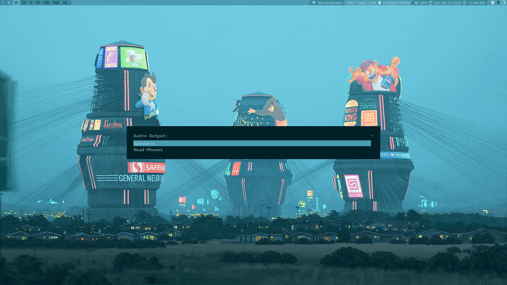

# Scripts
Utility scripts for the [qtile-chameleon](https://github.com/DioptricDesign/qtile-chameleon) project. 
## More information
For more information about this project check the [blog post.](https://wp.me/p8j8Cr-qe) 

## Dependencies
rofi, qtile, i3lock, pacmd, lmsensors, xautolock, compton, scrot, khal, vdirsyncer, dmenu,  urxvt, pywal
## Install
` git clone https://github.com/DioptricDesign/scripts.git`  
` cd scripts/ `\
` chmod +x bin/* `\
` sudo cp bin/* /usr/local/bin `\
` mkdir ~/.local/share/scripts ` \
` cp *.sh ~/.local/share/scripts `
## Screen Shots 

>wallpaper [Simon Stålenhag](https://www.simonstalenhag.se/)

>wallpaper [Patrik Göthe](https://unsplash.com/photos/xiTFENI0dMY)

>wallpaper [Hendrik Kespohl](https://unsplash.com/photos/2vlCKayU1e4)
## Special Thanks
Thank you Cramer Marius for your [rofi-scripts](https://github.com/cramermarius/rofi-menus) repository. 
